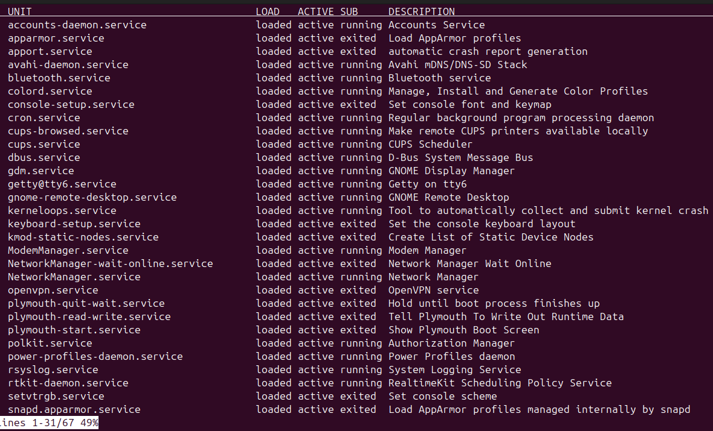
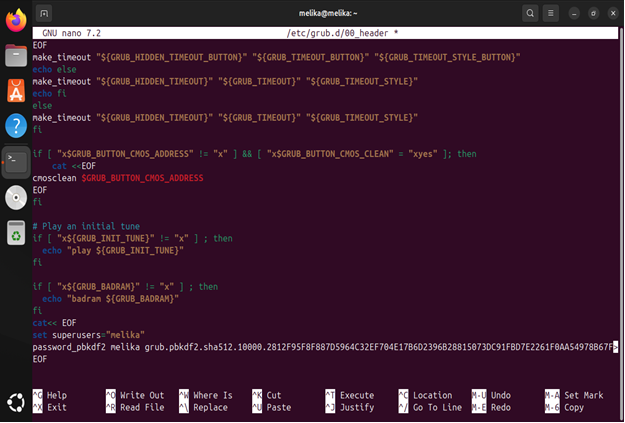

**Grub-Password-Setup**

GRUB Password Protection with PBKDF2 This guide secures GRUB by setting
a password using PBKDF2. It involves generating a hashed password,
editing the GRUB config, updating it, and verifying changes. After
rebooting, GRUB will prompt for a username and password, preventing
unauthorized access to boot settings.

**Setting a Superuser Password for GRUB**

This document provides a step-by-step guide to setting a superuser
password for GRUB using PBKDF2 encryption.

**Steps to Set GRUB Superuser Password**

**1. Generate PBKDF2 Password Hash**

Run the following command to generate a hashed password:

`grub-mkpasswd-pbkdf2`

Copy the generated hash.

**2. Edit GRUB Configuration File**

Open the GRUB configuration file for editing:

`sudo nano /etc/grub.d/00_header`

Add the following lines at the end of the file:

<pre>```cat \<\< EOF

set superusers=\"\<paste-your-username-here\>\"

password_pbkdf2 \<paste-your-username-here\>
\<paste-your-hashed-password-here\>

EOF```</pre>

Save the file:

- Press` CTRL + O ` and hit ` Enter `

- Press ` CTRL + X `to exit

**3. Update GRUB Configuration**

Run the following command to update GRUB:

`sudo update-grub2`

**4. Verify Configuration**

Check the GRUB configuration file to ensure the changes were applied:

`sudo cat /boot/grub/grub.cfg`

**5. Reboot System**

Finally, reboot your system to apply the changes:

`sudo reboot`

After rebooting, GRUB will now require authentication for administrative
actions. 




