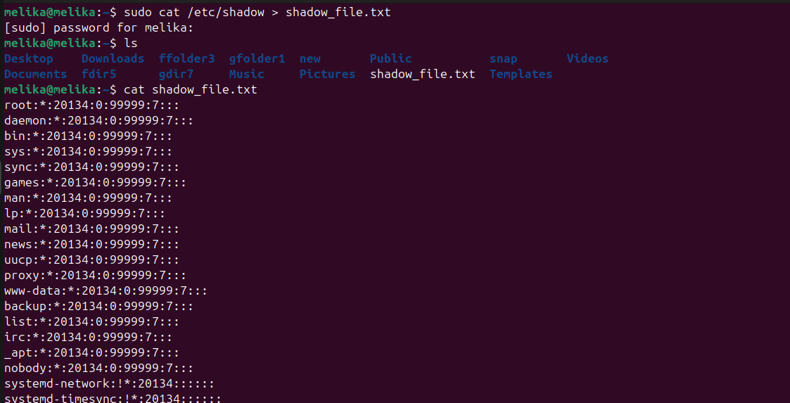

[1]{dir="rtl"}. [برای بوت لودر]{dir="rtl"} Grub [سیستم عامل لینوکس خود،
پسورد رمز شده بگذارید]{dir="rtl"}.

[مراحل کار را مستند نمایید]{dir="rtl"}.

- [پسورد هش]{dir="rtl"} PBKDF2

grub-mkpasswd-pbkdf2

- [ویرایش فایل پیکربندی]{dir="rtl"} GRUB

sudo nano /etc/grub.d/00_header

- [نام کاربری دلخواه و هش تولید‌شده خود را جایگزین می‌کنیم.]{dir="rtl"}

cat \<\< EOF

set superusers=\"\< username \>\"

password_pbkdf2 \< username \> \< hashed-password \>

EOF

- [به‌روزرسانی پیکربندی]{dir="rtl"} GRUB

sudo update-grub2

- [بررسی پیکربندی]{dir="rtl"}

sudo cat /boot/grub/grub.cfg

- [راه‌اندازی مجدد سیستم]{dir="rtl"}

sudo reboot

{width="6.509722222222222in"
height="4.405555555555556in"}{width="6.509722222222222in"
height="4.061805555555556in"}
