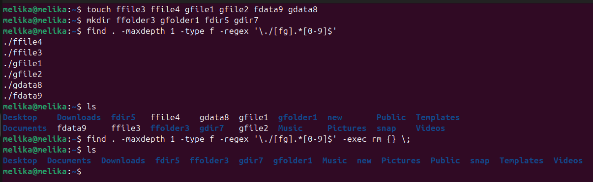

**Difference Between init and telinit Commands in Linux**

In traditional SysVinit-based Linux systems, two important commands are
used to manage **runlevels**:
` init `and` telinit `.

**Key Differences**

| Feature        | `init`                                                                 | `telinit`                                                                 |
|----------------|------------------------------------------------------------------------|---------------------------------------------------------------------------|
| **Main Role**   | Main process responsible for booting and managing runlevels (PID 1)   | Interface to send commands to the `init` process                          |
| **Execution**   | Executed directly by the system or administrator                      | Used to communicate with `init` during system runtime                     |
| **Common Usage**| Used in system boot or manually (e.g., `init 3`)                      | Used to change runlevel while the system is running (e.g., `telinit 5`)   |
| **Dependency**  | Works independently                                                   | Depends on `init`<br>(usually a symbolic link to `init`)                  |


**Checking the Link Between the Two**

You can verify that` telinit `is a symbolic link to` init `using the
following command:

```bash
ls -l /sbin/init /sbin/telinit
```
Example output:

```bash
lrwxrwxrwx 1 root root 4 Apr 1 /sbin/telinit -> init

-rwxr-xr-x 1 root root 123456 Apr 1 /sbin/init
```



**Usage Examples**

- Switch to multi-user (text) runlevel:

```bash
sudo telinit 3
```


- Switch to graphical runlevel:

```bash
sudo init 5
```


- Check current and previous runlevel:

```bash
runlevel
```