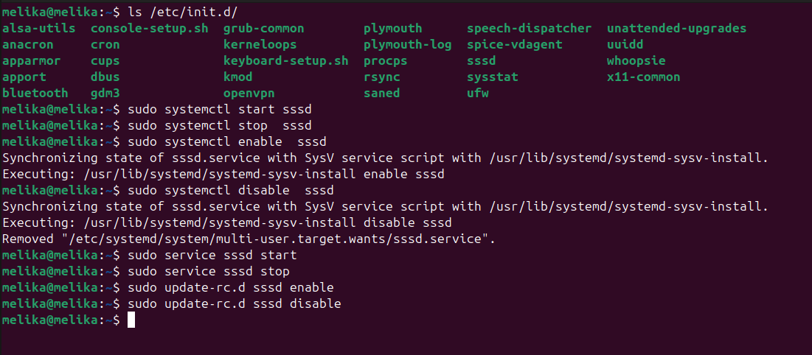

**Difference Between init and telinit Commands in Linux**

In traditional SysVinit-based Linux systems, two important commands are
used to manage **runlevels**: init and telinit.

**Key Differences**

  ------------------------------------------------------------------------
  **Feature**   **init**                     **telinit**
  ------------- ---------------------------- -----------------------------
  Main Role     Main process responsible for Interface to send commands to
                booting and managing         the init process
                runlevels (PID 1)            

  Execution     Executed directly by the     Used to communicate
                system or administrator      with init during system
                                             runtime

  Common Usage  Used in system boot or       Used to change runlevel while
                manually (e.g., init 3)      the system is running
                                             (e.g., telinit 5)

  Dependency    Works independently          Depends on init (usually a
                                             symbolic link to init)
  ------------------------------------------------------------------------

**Checking the Link Between the Two**

You can verify that telinit is a symbolic link to init using the
following command:

ls -l /sbin/init /sbin/telinit

Example output:

lrwxrwxrwx 1 root root 4 Apr 1 /sbin/telinit -\> init

-rwxr-xr-x 1 root root 123456 Apr 1 /sbin/init

{width="6.5in"
height="1.3020833333333333in"}

**Usage Examples**

- Switch to multi-user (text) runlevel:

{width="6.479166666666667in"
height="1.2291666666666667in"}sudo telinit 3

- Switch to graphical runlevel:

{width="6.5in"
height="3.375in"}sudo init 5

- Check current and previous runlevel:

runlevel
