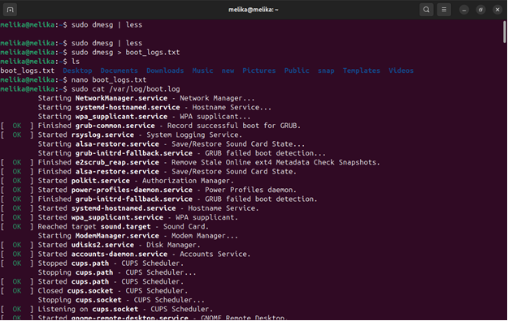

**Linux Boot Logs and System Information**

This document provides a step-by-step guide to extracting and analyzing
various boot logs and system information on a Linux machine.

**Steps to Retrieve Boot Logs**

**1. View Boot Messages in Real-time**

Run the following command to view boot logs interactively:

```bash
sudo dmesg | less
```

**2. Save Boot Logs to a File**

To save the boot logs for later analysis, use:

```bash
sudo dmesg > boot_logs.txt
```

**3. Verify the File Existence**

Check the saved file using:

```bash
ls

nano boot_logs.txt
```

**4. View System Boot Log**

To check the boot log stored in system logs, run:

```bash
sudo cat /var/log/boot.log
```

**5. Search for BIOS-related Messages**

Extract BIOS-related messages from the boot log using:

```bash
sudo dmesg | grep -i "bios"

Save these messages to a file:

sudo dmesg | grep -i "bios" > bios.txt
```

**6. Verify BIOS Log File**

Check if the file was created and examine its contents:

```bash
ls

nano bios.txt
```

**GRUB Configuration Analysis**

**7. View GRUB Configuration File**

To inspect the current GRUB configuration, run:

```bash
sudo cat /boot/grub/grub.cfg
```

**8. Search for GRUB Superuser Settings**

Find GRUB superuser settings in the configuration file:

```bash
sudo grep -i -A 3 -B 3 'superusers' /boot/grub/grub.cfg
```
**9. Save GRUB Configuration to a Report**

Store the GRUB configuration in a separate file for analysis:

```bash
sudo cat /boot/grub/grub.cfg > grub_report.txt
```
**10. Verify GRUB Report File**

Check if the file is successfully created and view its contents:

```bash
ls

nano grub_report.txt
```
**Hardware and BIOS Information**

**11. Retrieve System Hardware Information**

Use `dmidecode` to extract detailed hardware information:

```bash
sudo dmidecode
```
Save the output to a file:

```bash
sudo dmidecode > logs.txt
```
**12. Verify Logs File**

Check the created file:

```bash
ls

nano logs.txt
```
**13. Retrieve BIOS Information Only**

To extract only BIOS-related details, use:

```bash
sudo dmidecode -t bios
```
Save this information to a separate file:

```bash
sudo dmidecode -t bios > bios_logs.txt
```
**14. Verify BIOS Logs File**

Check if the file was created and inspect its contents:

```bash
ls

nano bios_logs.txt
```
**Journal Logs**

**15. View GDM (GNOME Display Manager) Boot Logs**

To analyze the logs related to the GNOME Display Manager:

```bash
sudo journalctl -b -u gdm
```
By following these steps, you can extract detailed information regarding
system boot logs, BIOS details, and GRUB settings for further analysis
and troubleshooting.





![C:\\Users\\zst2023\\Desktop\\تمرین از سیستم\\تمرین 2\\Screenshot from
2025-05-23
16-14-31.png]

